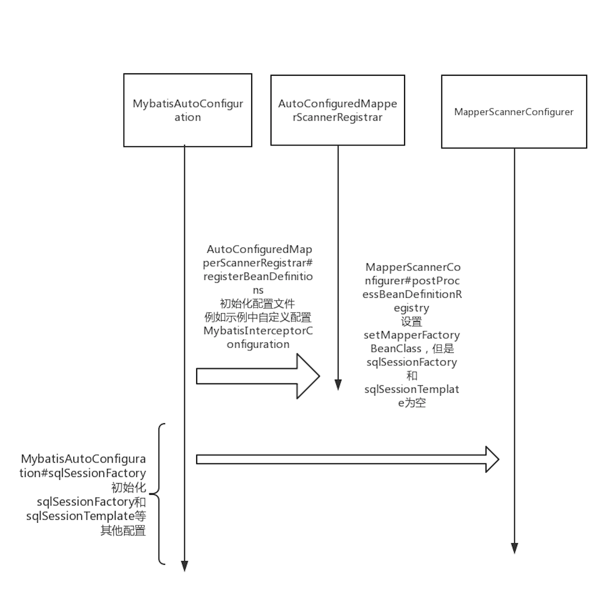

# Mybatis-spring-boot整合

## 1.环境

- jdk8
- mybatis-spring-boot-starter 2.1.0
- springboot 2.2.1.BUILD-SNAPSHOT

## 2.核心类分析

分析之前，建议查看下面[链接](https://www.jianshu.com/p/3ad8edc22386) ,有利于理解本文内容

`MybatisAutoConfiguration`：springboot启动自动加载配置，配置中初始化`SqlSessionFactory`、

`SqlSessionTemplate` 和`MapperFactoryBean`

下面是流程图

 

)


## 3.示例代码

### 3.1.工程结构图

```text
├── pom.xml
├── src
│   ├── main
│   │   ├── java
│   │   │   └── com
│   │   │       └── zzm
│   │   │           ├── ArtsTenMybatisSpringBootApplication.java
│   │   │           ├── config
│   │   │           │   └── MybatisInterceptorConfiguration.java
│   │   │           ├── dao
│   │   │           │   └── BlogMapper.java
│   │   │           ├── entity
│   │   │           │   ├── Blog.java
│   │   │           │   ├── CompanyDto.java
│   │   │           │   └── UserTest.java
│   │   │           └── intercept
│   │   │               └── ExamplePlugin.java
│   │   └── resources
│   │       ├── application.yml
│   │       ├── mapper
│   │       │   └── BlogMapper.xml
│   │       ├── static
│   │       └── templates
```


### 3.2.pom依赖

```java
……………………
<dependency>
			<groupId>org.springframework.boot</groupId>
			<artifactId>spring-boot-starter-actuator</artifactId>
		</dependency>
		<dependency>
			<groupId>org.springframework.boot</groupId>
			<artifactId>spring-boot-starter-web</artifactId>
		</dependency>
   <!-- mybatis springboot 集成依赖-->
		<dependency>
			<groupId>org.mybatis.spring.boot</groupId>
			<artifactId>mybatis-spring-boot-starter</artifactId>
			<version>2.1.0</version>
		</dependency>
	 <!--mysql依赖 -->
		<dependency>
			<groupId>mysql</groupId>
			<artifactId>mysql-connector-java</artifactId>
		</dependency>
  …………………………
```

### 3.3. `MybatisInterceptorConfiguration`自定配置mybatis属性

- `Interceptor`插件
- `TypeHandler`类型转换器
-  `LanguageDriver`
-  `DatabaseIdProvider` 数据库提供商配置

```java
@Configuration
@EnableAutoConfiguration
public class MybatisInterceptorConfiguration {

    @Bean
    public ExamplePlugin myInterceptor() {
        return new ExamplePlugin();
    }

}
```

### 3.4.application.yml配置

```yam
server:
  port: 8082

management:
  endpoints:
    web:
      exposure:
        exclude: '*'

spring:
  datasource:
    password: 123456
    username: root
    url: jdbc:mysql://localhost:3306/test
<!-- sql打印日志级别--->
logging:
  level:
    root: info
    com:
      zzm:
        dao: trace
<!-- mybatis扫描xml配置路径-->
mybatis:
  mapper-locations: classpath*:/mapper/*.xml
```


 

##4. `Configuration` 

它是mybatis-springboot配置mybatis中属性，例如 `mapper-locations`、`type-handlers-package`等


[代码地址](https://github.com/knowledgeAlan/arts-ten/tree/master/arts-ten-mybatis-spring-boot) 

[参考链接](https://github.com/mybatis/spring-boot-starter) 